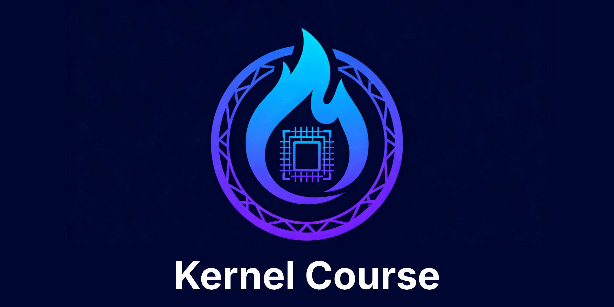

  

Learn how to develop high-performance kernels with [PyTorch](https://github.com/pytorch/pytorch), [Triton](https://github.com/triton-lang/triton), and [CuTe](https://github.com/NVIDIA/cutlass) while preserving numerical equivalence with the Python reference implementations. The exercises emphasize translating clear Python prototypes into optimized GPU kernels without sacrificing correctness.

## Why

Learning high-performance computing as a non-CS major has been quite challenging for me. While I can grasp the fundamental concepts of HPC, I often struggle with effectively utilizing various frameworks to combine mathematical computations, memory layouts, and data transfers efficiently. To address this, I selected three popular frameworks: PyTorch for rapid mathematical implementations, Triton for parallel computations, and CuTe for maximizing performance through low-level memory management and thread scheduling. By progressively implementing foundational linear algebra operations in these frameworks and combining them into Transformer modules, I aim to enhance my skills. I believe this process will be beneficial to others as well, so I've decided to document it for sharing. Happy learning!

## Basic Linear Algebra Subprograms

The following common BLAS kernels have been implemented in multiple frameworks. For each kernel, a ✅ indicates that the implementation is complete and verified to be numerically equivalent to the Python reference, a ❌ indicates that the implementation is pending. For more details on each kernel, please **click the name or icon**.

| Name | Description | Equation | Flops | Data | Python | PyTorch | Triton | CuTe | Test |
| --- | --- | --- | --- | --- | --- | --- | --- | --- | --- |
| [copy](./docs/copy.md) | copy vector | $y = x$ | $0$ | $2n$ | [✅](./kernel_course/python_ops/copy.py) | [✅](./kernel_course/pytorch_ops/copy.py) | [✅](./kernel_course/triton_ops/copy.py) | ❌ | [✅](./tests/test_copy.py) |
| [swap](./docs/swap.md) | swap vectors | $x \leftrightarrow y$ | $0$ | $4n$ | [✅](./kernel_course/python_ops/swap.py) | [✅](./kernel_course/pytorch_ops/swap.py) | [✅](./kernel_course/triton_ops/swap.py) | ❌ | [✅](./tests/test_swap.py) |
| [scal](./docs/scal.md) | scale vector | $y = \alpha y$ | $n$ | $2n$ | [✅](./kernel_course/python_ops/scal.py) | [✅](./kernel_course/pytorch_ops/scal.py) | [✅](./kernel_course/triton_ops/scal.py) | ❌ | [✅](./tests/test_scal.py) |
| [axpby](./docs/axpby.md) | update vector| $y = \alpha x + \beta y$ | $3n$ | $3n$ | [✅](./kernel_course/python_ops/axpby.py) | [✅](./kernel_course/pytorch_ops/axpby.py) | [✅](./kernel_course/triton_ops/axpby.py) | ❌ | [✅](./tests/test_axpby.py) |
| [dot](./docs/dot.md) | dot product | $z = x^\top y$ | $2n$ | $2n$ | [✅](./kernel_course/python_ops/dot.py) | [✅](./kernel_course/pytorch_ops/dot.py) | [✅](./kernel_course/triton_ops/dot.py) | ❌ | [✅](./tests/test_dot.py) |
| [gemv](./docs/gemv.md) | general matrix-vector multiply | $y = \alpha A x + \beta y$ | $2mn$ | $mn + n + 2m$ | [✅](./kernel_course/python_ops/gemv.py) | [✅](./kernel_course/pytorch_ops/gemv.py) | [✅](./kernel_course/triton_ops/gemv.py) | ❌ | [✅](./tests/test_gemv.py) |
| [geru](./docs/geru.md) | general rank-1 update | $A = A + \alpha x y^\top$ | $2mn$ | $2mn + m + n$ | [✅](./kernel_course/python_ops/geru.py) | ❌ | ❌ | ❌ | ❌ |
| gemm | general matrix-matrix multiply | $C = \alpha A B + \beta C$ | $2mnk$ | $mk + nk + 2mn$ | ❌ | ❌ | ❌ | ❌ | ❌ |

## Transformer Modules

The following common transformer modules have been implemented in multiple frameworks. For each module, a ✅ indicates that the implementation is complete and verified to be numerically equivalent to the Python reference, a ❌ indicates that the implementation is pending. For more details on each module, please **click the name or icon**.

> [!NOTE]
> TODO